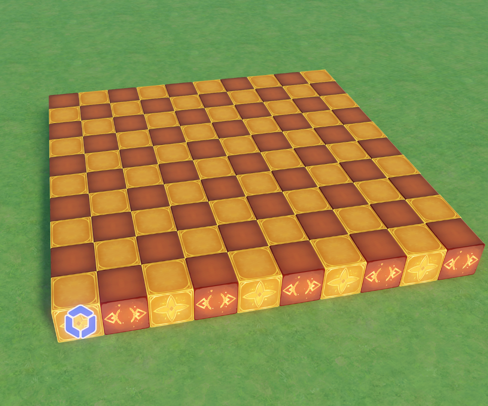

<div align="center">

<h1>UGC File Generate Utils</h1>

**一套Python工具集，用于解析和生成游戏存档数据文件（GIA/GIL格式）**

</div>


## 📖 简介

UGC File Generate Utils 是一套用于处理游戏实体数据的Python工具集。它可以：

- 🔍 **解析和检查** GIA/GIL 文件的 Protobuf 数据结构
- 🎨 **生成** 调用模块化工具，用代码生成实体数据，导出为 GIA/GIL 文件
- 🔧 **工具** 直接运行脚本，根据外部数据（二维码、图片、体素模型数据等）生成 GIA/GIL 文件


## ⚠️ 使用前注意
### 使用前请务必备份当前的存档！

脚本功能仍在测试中，可能出现 GUID 重合导致导入后存档损坏等未知问题。  
推荐在新建存档中导入生成的资产文件，或在导入前备份你当前的存档。  
出现问题可以在 Issue 中进行反馈。


## 🗃️ 提交代码 & 交流群

欢迎通过Pull requests提交你的代码！  
欢迎加入原神/千星奇域/米游QQ群: 1043830337


## ✨ 功能特性

### 工具

| 脚本                               | 说明                       |
|----------------------------------|--------------------------|
| `generate_qrcode.py`             | 输入文字，生成二维码方块墙（为防止滥用已删除）  |
| `parser/parser_with_proto.py`    | 使用已知的Proto结构，解析指定的存档文件   |
| `parser/parser_with_raw_data.py` | 使用decode_raw方式，解析指定的存档文件 |

### 核心模块

| 模块                             | 说明                 |
|--------------------------------|--------------------|
| `helper/file_writer.py`        | 读取和保存存档文件，自动处理文件头尾 |
| `config/block_config.py`       | 定义可用的方块信息          |
| `assembler/block_assembler.py` | 将方块数据转换为Protobuf格式 |


## 🚀 快速开始

### 环境要求

- Python 3.8 或更高版本


### 初始化步骤

#### 1. 克隆仓库

#### 2. 初始化submodule

```bash
git submodule update --init --recursive
```

#### 2. 创建虚拟环境

```bash
# Linux/Mac
python3 -m venv venv
source venv/bin/activate

# Windows
python -m venv venv
venv\Scripts\activate
```

#### 3. 安装依赖

```bash
pip install -r requirements.txt
```


## 📚 直接使用工具

### 1. 如Proto仓库有更新，更新Protobuf

#### 拉取最新的Proto仓库

```bash
# 更新submodule到最新版本
git submodule update --remote proto

# 或手动进入proto目录更新
cd proto
git pull origin master
cd ..
```

#### 编译Protobuf

```bash
# Linux/Mac
chmod +x generate_proto.sh
./generate_proto.sh

# Windows
./generate_proto.bat
```

#### 验证

```bash
python -c "from proto_gen import asset_pb2, gia_pb2; print('安装成功')"
```

### 2. 生成二维码方块墙（为防止滥用已删除）

将任意文本转换为游戏中的3D二维码：

```bash
python generate_qrcode.py
```

**输入：**
```
请输入要生成二维码的文本: Hello World
```

**输出：**
- `output/qrcode_entities.gia` - 游戏实体文件
- `output/qrcode_preview.png` - 二维码预览图

**配置选项：**

编辑 `generate_qrcode.py` 中的 `Config` 类：

```python
class Config:
    # 方块模板ID配置
    BLACK_TEMPLATE_ID = 20002121  # 黑色方块
    WHITE_TEMPLATE_ID = 20002146  # 白色方块

    # 全局缩放
    GLOBAL_SCALE = 0.5

    # 空间配置
    AXIS_MAPPING = {
        'horizontal': 'x',  # 二维码水平方向对应的轴
        'vertical': 'y',    # 二维码垂直方向对应的轴
        'depth': 'z'        # 二维码深度方向对应的轴
    }

    # 起始位置（左下角第一个方块的坐标）
    START_POSITION = {
        'x': 0.0,
        'y': 0.0,
        'z': 0.0
    }

    # 二维码配置
    QR_VERSION = 1  # 二维码版本（1-40）
    QR_ERROR_CORRECTION = qrcode.constants.ERROR_CORRECT_L  # 纠错级别
    QR_BOX_SIZE = 1  # 每个格子的像素大小
    QR_BORDER = 1  # 边框大小（格子数）

    # 起始实体ID
    ENTITY_ID_START = 1078000000
```


### 3. 检查和分析存档文件

使用已知的Proto结构文件解析：

```bash
python parser/parser_with_proto.py
```
或使用decode_raw方式解析：
```bash
python parser/parser_with_raw_data.py
```

选择要检查的GIA/GIL文件，自动生成可读的解析报告。

**输出示例：**

```
1 {
  1 {
    2: 1
    3: 2
    4: 1077936129
  }
  3: "木质立方体"
  5: 3
  12 {
    1 {
      1: 1077936129
      ...
    }
  }
}
```


## 💡 调用模块二次开发

### 示例一: 生成10x10颜色交替网格

```python
# 需要将proto_gen文件夹加入module搜索路径中
import sys
import os
sys.path.append(os.path.join(os.path.dirname(__file__), "proto_gen"))

from typing import List
from helper.block_helper import BlockHelper
from model.block_model import BlockModel
from assembler.block_assembler import BlockAssembler
from helper.file_helper import FileHelper

blocks = []
for x in range(10):
    for z in range(10):
        # 需要确保template_id在block_config中已定义
        template_id = 20001869 if (x + z) % 2 == 0 else 20001870
        template = BlockHelper.get_template_by_id(template_id)
        # 使用工具类计算位置
        position_x, position_y, position_z = BlockHelper.calculate_position(x, 0, z)
        # 不同的方块有基础缩放属性，使用工具类计算缩放
        scale_x, scale_y, scale_z = BlockHelper.calculate_scale(template)
        block = BlockModel(
            template_id=template_id,
            name=f"Grid_{x}_{z}",
            position_x=position_x,
            position_y=position_y,
            position_z=position_z,
            scale_x=scale_x,
            scale_y=scale_y,
            scale_z=scale_z
        )
        blocks.append(block)

assembler = BlockAssembler(entity_id_start=1078000000)
# 根据方块数据生成proto数据
proto_data = assembler.assemble(blocks)
# 导出为gia文件，自动组装头尾数据
FileHelper.save(proto_data, "output/grid_10x10.gia")
```



### 示例二: 使用简单随机算法，在区域内随机放置树木

```python
# 需要将proto_gen文件夹加入module搜索路径中
import sys
import os
sys.path.append(os.path.join(os.path.dirname(__file__), "proto_gen"))

import random
import math
from typing import List, Tuple, Optional
from model.block_model import BlockModel
from assembler.block_assembler import BlockAssembler
from helper.file_helper import FileHelper


def random_next_position(blocks: List[BlockModel]) -> Optional[Tuple[float, float]]:
    retry = 0
    while retry < 100:
        retry += 1
        x = random.uniform(0.0, 50.0)
        z = random.uniform(0.0, 50.0)
        if any([math.sqrt((x - block.position_x) ** 2 + (z - block.position_z) ** 2) < 5 for block in blocks]):
            return None
        return x, z
    return None


TREE_TEMPLATE_ID = [20001001, 20001002, 20001003, 20001198, 20001199, 20001200, 20001201, 20001413, 20001414, 20001415,
                    20001469, 20001470, 20001471, 20001472, 20001473, 20001543, 20001544, 20001545, 20002179, 20002180,
                    20002181, 20002182, 20002183, 20002184]

blocks: List[BlockModel] = []

for i in range(50):
    position = random_next_position(blocks)
    if position is None:
        continue

    template_id = random.choice(TREE_TEMPLATE_ID)

    blocks.append(BlockModel(
        template_id=template_id,
        name=f"Tree_{i}",
        position_x=position[0],
        position_z=position[1]
    ))

assembler = BlockAssembler(entity_id_start=1078000000)
proto_data = assembler.assemble(blocks)
FileHelper.save(proto_data, f"output/random_trees.gia")
```


## 📜 开源协议

本项目采用 Apache License 2.0 协议开源  
详见 [LICENSE](LICENSE) 文件
